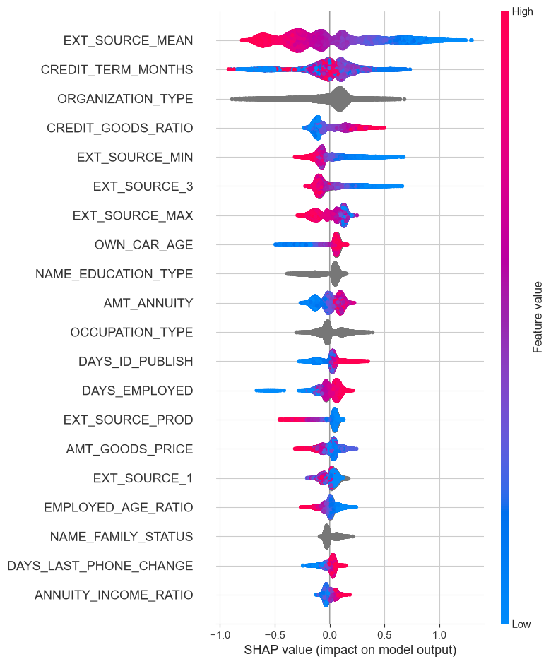
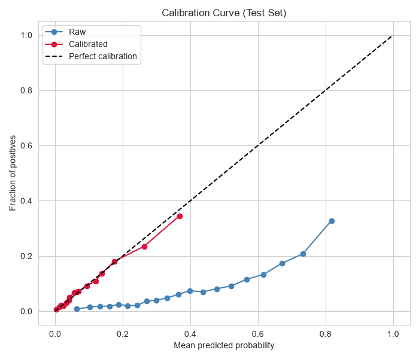
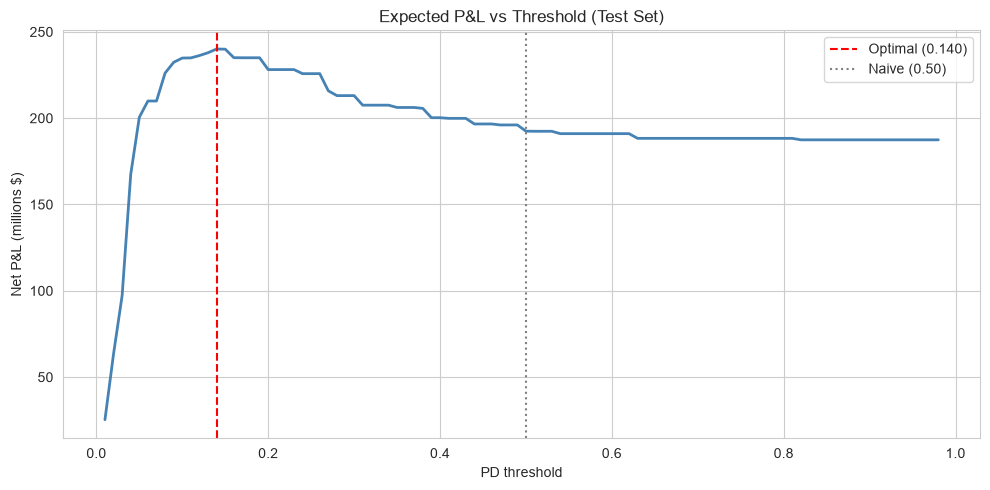
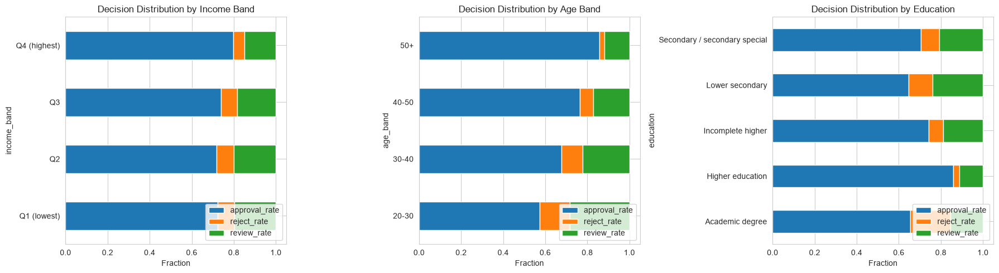

# Credit Risk Decision Engine

An end-to-end machine learning system that scores loan applications for default risk, recommends approve/review/reject decisions, and quantifies business impact in dollars.

## Business Problem

Consumer lenders lose money on two fronts:

1. **Defaults** — approving applicants who don't repay.
2. **Missed profit** — rejecting applicants who would have repaid.

Traditional credit scorecards use logistic regression. Modern gradient boosting improves accuracy but is hard to interpret — a problem for regulatory compliance. This project demonstrates that an accurate, interpretable, and fair decisioning system can be built and deployed.

## Highlights

- **Model:** LightGBM (tuned via Optuna) achieving test AUC **0.766** and KS **0.396**
- **Calibration:** Isotonic regression reduced test Brier score by **63%** (0.178 → 0.067)
- **Decisioning:** Cost-sensitive thresholds improved net P&L by **$52.6M** vs. naive 0.50 threshold on a 46K-loan test set
- **Fairness:** CODE_GENDER excluded; approval-rate gaps audited across income, age, and education
- **Explainability:** SHAP-based reason codes for every decision
- **Deployment:** FastAPI scoring service + Streamlit dashboard + Docker

## Architecture

```
┌──────────────────┐     ┌──────────────────┐     ┌──────────────────┐
│  Raw applicant   │────▶│  Feature pipeline│────▶│  LightGBM model  │
│  (JSON)          │     │  (ratios, aggs)  │     │  + calibrator    │
└──────────────────┘     └──────────────────┘     └────────┬─────────┘
                                                           │
                                                           ▼
┌──────────────────┐     ┌──────────────────┐     ┌──────────────────┐
│  Streamlit       │◀────│  FastAPI         │◀────│  Decision policy │
│  dashboard       │     │  /predict        │     │  (PD thresholds) │
└──────────────────┘     └──────────────────┘     └──────────────────┘
```

## Results

### Model Performance (Test Set)

| Metric | Value |
|---|---|
| AUC | 0.766 |
| KS | 0.396 |
| Brier (raw) | 0.178 |
| Brier (calibrated) | 0.067 |

### Business Impact (46,127 test loans)

| Policy | Approval Rate | Net P&L |
|---|---|---|
| Approve all | 100.00% | $187.4M |
| Naive threshold (0.50) | 99.62% | $192.5M |
| Optimal binary (0.14) | 83.50% | $240.1M |
| **Three-way (0.10 / 0.20)** | **74.40%** | **$252.6M** |

**+$65.1M improvement over approve-all.**

### Fairness Audit

| Group | Approval Rate | Actual Default Rate |
|---|---|---|
| Income Q1 (lowest) | 72.4% | 8.35% |
| Income Q4 (highest) | 79.8% | 6.47% |
| Age 20-30 | 57.4% | 11.00% |
| Age 50+ | 85.7% | 5.40% |

Approval-rate gaps align with actual-default-rate gaps. CODE_GENDER excluded for regulatory compliance (cost: -0.0006 AUC).

## Repository Structure

```
credit-risk-decision-engine/
├── data/                    # Data (gitignored)
├── models/                  # Trained artifacts (gitignored)
├── notebooks/               # Analysis notebooks (01-05)
├── reports/
│   ├── model_card.md        # Full model documentation
│   ├── assumptions.md       # Business assumptions
│   └── figures/             # Key plots
├── scripts/
│   └── test_api.py          # Sample API request
├── src/
│   ├── api/                 # FastAPI service
│   ├── dashboard/           # Streamlit app
│   └── features/            # Feature engineering
├── tests/                   # Unit tests
├── Dockerfile
├── requirements.txt
└── README.md
```

## Setup

### 1. Clone and install

```bash
git https://github.com/rohitmanda49/credit-risk-decision-engine.git
cd credit-risk-decision-engine
python -m venv .venv
source .venv/bin/activate   # or .venv\Scripts\activate on Windows
pip install -r requirements.txt
```

### 2. Get the data

Download `application_train.csv` from [Home Credit Default Risk](https://www.kaggle.com/c/home-credit-default-risk/data) and place in `data/raw/home_credit/`.

### 3. Build the model

Run notebooks `01` through `04` in order. This produces the trained model, calibrator, and metadata in `models/`.

### 4. Run the API

```bash
python -m uvicorn src.api.main:app --reload --port 8000
```

Interactive docs at [http://localhost:8000/docs](http://localhost:8000/docs).

### 5. Run the dashboard

In another terminal:

```bash
python -m streamlit run src/dashboard/app.py
```

Opens at [http://localhost:8501](http://localhost:8501).

### 6. Docker (optional)

```bash
docker build -t credit-risk-api .
docker run -p 8000:8000 credit-risk-api
```

**Note:** Requires Docker Desktop. Tested with Python 3.11 base image.

## Screenshots

### Dashboard — Approve Decision


### SHAP Beeswarm — Global Feature Importance


### Calibration Curve


### Threshold Sweep — P&L vs Decision Threshold


### Fairness Audit


## Key Technical Decisions

- **Temporal split** via SK_ID_CURR as a proxy for origination order (no explicit date column).
- **Isotonic calibration** on validation set to make probabilities trustworthy for financial calculations.
- **Cost-sensitive thresholds** derived from business costs (LGD, profit margin, review capacity) — not from accuracy or F1.
- **Three-way decisioning** with review capacity constraint (top 5%).
- **SHAP reason codes** for every decision.
- **CODE_GENDER excluded** for fair lending compliance; effect quantified as 0.0006 AUC.

## Limitations

- Home Credit data is anonymized; may not generalize to other markets.
- No explicit origination date — temporal proxy documented.
- Assumes stable macroeconomic conditions.
- Review capacity modeled as perfect; real reviewers have error rates.
- Trained on consumer credit only.

See `reports/model_card.md` for full documentation.

## Tech Stack

Python • pandas • scikit-learn • LightGBM • Optuna • SHAP • FastAPI • Streamlit • Docker • MLflow

## License

MIT — see [LICENSE](LICENSE).
